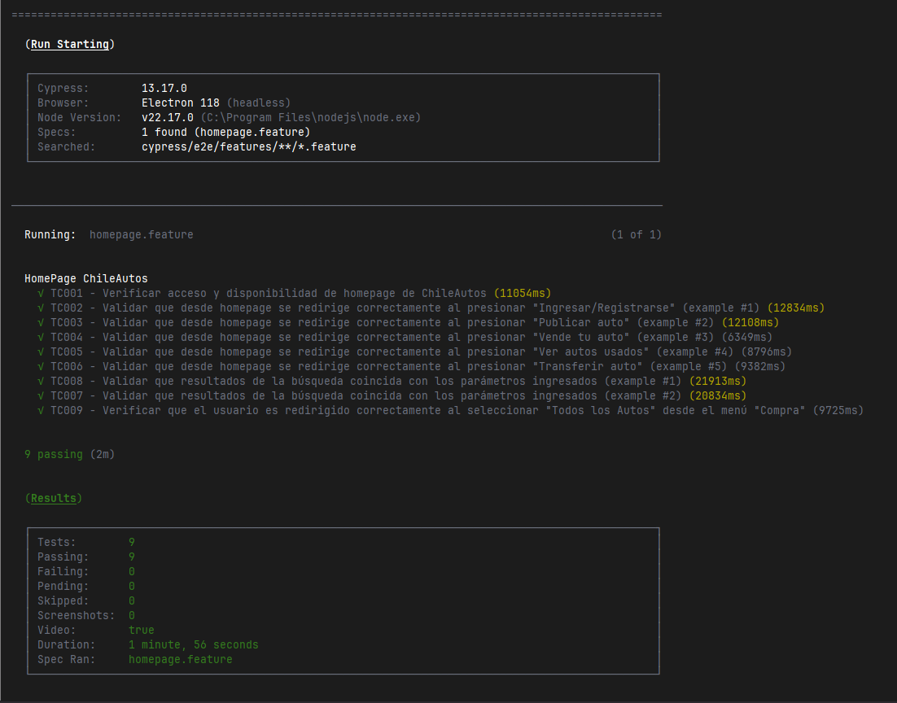
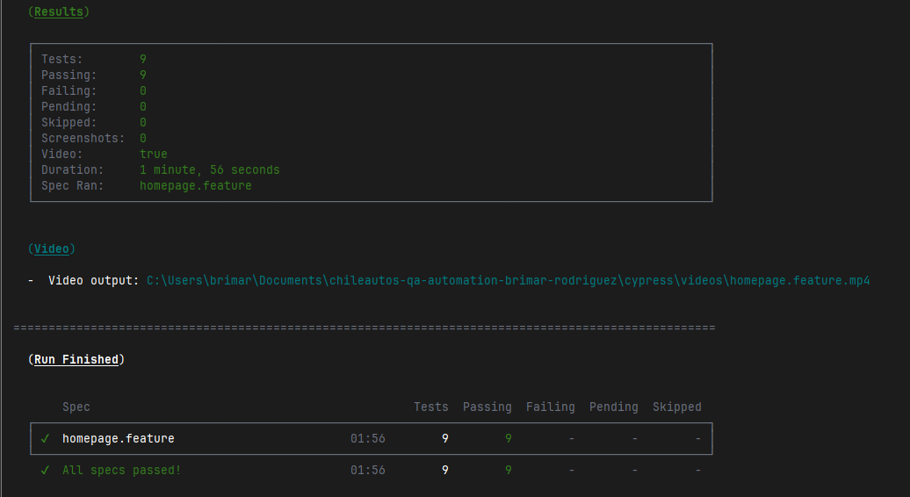

# Chileautos QA Automation – Homepage

Suite de pruebas automatizadas para validar homepage de Chileautos.cl, usando como framework de automatización
**Cypress**, además de utilizar una capa de **Cucumber** y como patrón de diseño **Page Object Model**.

## 1. Estrategia de Testing

### a) Flujos críticos priorizados

1. "Ingresar"/"Registrarse"
    - Negocio: permite transformar visitantes anónimos en usuarios identificados, habilitando funciones clave como publicar vehículos.
    - Riesgo: errores en autenticación y/o registro bloquean el acceso a funciones claves.

2. Flujo "Publicar auto"/"Vende tu auto"
    - Negocio: entrada principal para vendedores, impacto directo en inventario.
    - Riesgo: caída o error reduce el volumen de avisos publicados.

3. Sección de Búsqueda
    - Negocio: el buscador con filtros es el motor central del proceso de compra, conectando compradores con la oferta más relevante y acelerando la decisión de compra.
    - Riesgo: filtros incorrectos o inconsistentes provocan frustración y abandono del sitio.

4. Navegación a la opción "Todos los Autos" desde el menú "Compra"
    - Negocio: flujo necesario para usuarios que buscan comprar un auto.
    - Riesgo: fallo aquí reduce oportunidades reales de venta o contacto comercial.

5. Sección "¿Qué harás hoy?" y acceso a opciones principales ("Ver autos usados", "Preguntas frecuentes", "Transferir auto")
    - Negocio: guía rápida al usuario hacia los funnels más usados.
    - Riesgo: Enlaces rotos generan mala experiencia inicial y abandono.

### b) Tipos de pruebas que implementaría

- **Funcionales E2E**  
  Validar navegación, visibilidad de secciones, acciones y flujos end-to-end principales desde el homepage hasta las páginas de destino.

- **Regresión**  
  Escenarios estables que cubren los flujos críticos. Se ejecutan en cada release, integración de nuevas funcionalidades o cambio relevante del frontend.

- **Smoke test**
  Para validaciones rápidas de flujos críticos.

- **Performance**  
  Medición de tiempos de carga de botones, imágenes, elementos del homepage y recursos.

- **Seguridad**  
  Validación básica: uso de HTTPS, ausencia de contenido mixto visible, no exposición de datos sensibles en URL o en mensajes de error.

- **Usabilidad**  
  Presencia de textos descriptivos, navegación clara, acciones visibles, mensajes legibles y comprensibles.

### c) Cobertura de pruebas y métricas

Cobertura basada en **riesgo + criticidad de negocio**, no solo en número de tests.

Métricas clave:

- % de flujos críticos automatizados (Smoke + Regresión).
- % de historias de usuario con al menos 1 test E2E automatizado.
- Defectos detectados en QA vs Producción.
- Tiempo promedio de ejecución del suite y su estabilidad.
- Tendencia de fallos por release.

---

## 2. Arquitectura y Diseño

### a) Estructura de carpetas

- `cypress/e2e/features`: features Cucumber en BDD.
- `cypress/e2e/step_definitions`: glue code que usa Page Objects Model.
- `cypress/support/pages`: Page Objects (HomePage, ListingPage, entre otros.).
- `cypress/support/helpers`: funciones de soporte (ambientes, utilidades).
- `cypress/fixtures`: datos de prueba reutilizables.
- `cypress/support/commands.js`: comandos customizados.
- `cypress/support/common.js`: métodos comunes.

Justificación:

- Separación clara entre **qué** se prueba (features) y **cómo** se implementa (steps + POM).
- Facilita mantenibilidad, escalabilidad y reuso de componentes.
- Evita duplicidad de código.

### b) Patrones de diseño

- **Page Object Model (POM)**
    - Encapsula selectores y acciones de cada página.
    - Reduce duplicación de código y facilita cambios en el DOM.
    - Agiliza mantenimiento y actualización de datos, id, entre otros.

- **Capa BDD con Cucumber**
    - Features legibles por negocio.
    - Steps delgados que solo orquestan acciones de los POM.

Resultado: tests más legibles, mantenibles y alineados a lenguaje de negocio.

---

## 3. Gestión de Datos y Ambientes

### a) Datos de prueba

- Uso de `fixtures` para datos estáticos (usuarios de prueba, filtros, textos esperados).
- Datos sensibles o credenciales reales se gestionan por variables de entorno.
- Estructura clara por tipo de dato: `users.json`, `filters.json`.

### b) Estrategia multi-ambiente

- URLs de ambientes (dev, qa, uat, prod) definidas en `cypress.config.js`.
- Selección de ambiente por variable `ENVIRONMENT` en scripts npm.
- Misma suite de tests ejecutada contra distintos ambientes sin cambios de código.

Ejemplo:
- `npm run test:dev` → ejecuta sobre DEV
- `npm run test:qa` → ejecuta sobre QA
- `npm run test:prod` → ejecuta sobre PROD

### c) Elementos dinámicos, tiempos de espera y sincronización

- Uso de **esperas implícitas de Cypress** (`should`, `contains`) en lugar de `cy.wait` fijos.
- Selectores robustos basados en texto visible o atributos semánticos: `id`, `test-data`, `clase`, `xpath`.
- Donde sea necesario, espera explícita basada en condición (`url`, visibilidad de componente) mediante helpers dedicados.

---

## 4. CI/CD y DevOps

### a) Gates de calidad antes de producción

- **Gate 1**: unit tests y linters del frontend.
- **Gate 2**: ejecución de smoke E2E sobre ambiente de integración.
- **Gate 3**: suite de regresión priorizada (alta criticidad) sobre uat.
- **Gate 4**: checks básicos de performance y accesibilidad en homepage y flujos críticos.

Si falla cualquiera de estos gates, no se promueve a producción.

### b) Optimización de tiempos

- División de tests por tags (`@smoke`, `@regression`, `@accessibility`).
- Paralelización por grupos de specs en el runner de CI.
- Estrategia de **regresión incremental**:
    - PRs → solo smoke + tests impactados.
    - Nightly → regresión completa.

---

## 5. Reporting y Análisis

Un reporte ideal debe incluir:

- Resumen ejecutivo: cantidad de tests ejecutados: passed, failed, skipped.
- Detalle por tag (`@smoke`, `@regression`, `@accessibility`).
- Tiempos de ejecución por suite y por escenario.
- Lista de fallos con: pasos, capturas de pantalla y videos.

**Para stakeholders no técnicos:** foco en **estado (verde/rojo)**, **riesgos** y **impacto**.  
**Para técnicos:** detalle de stacktrace, logs y pasos exactos.

---

## 6. Seguridad y Calidad

### a) Validaciones de seguridad básicas en UI

- Verificar uso de **HTTPS** y ausencia de contenido mixto.
- Validar que URLs no expongan datos sensibles ni tokens.
- Validar mensajes de error genéricos (no filtren información sensible de backend).
- Comportamiento de sesión básico (logout correcto, no volver a páginas sensibles por back del navegador).

### b) Accesibilidad (WCAG)

- Validar presencia de títulos, etiquetas descriptivas y jerarquía de encabezados.
- Chequear contraste de texto legible en elementos críticos (botones, links).
- Integrar herramienta como `cypress-axe` para validación automática contra WCAG A/AA.
- Validar foco de teclado en elementos interactivos principales.

### c) Herramientas complementarias a Cypress para seguridad

- **OWASP ZAP** o herramientas DAST para análisis dinámico.
- **Snyk / Dependabot** para vulnerabilidades en dependencias.
- **SonarQube** para análisis estático de código del frontend.

---

## 7. Tecnologías y herramientas

- Cypress
- Cucumber (`@badeball/cypress-cucumber-preprocessor`)
- Page Object Model
- Node.js / npm

---

## 8. Prerequisitos

- Node.js LTS instalado
- npm o yarn
- Acceso a los ambientes de Chileautos

---

## 9. Instalación

```
git clone https://github.com/brimarrodriguez/chileautos-qa-automation-brimar-rodriguez/tree/main
cd chileautos-qa-automation-brimar-rodriguez
npm install
```

---

## 10. Ejecución de pruebas

- Ejecutar todas las pruebas sobre PROD: ```npm test```
- Ejecutar en modo interactivo:  ```npm run test:headed```
- Ejecutar sobre otro ambiente:  ```npm run test:dev```, ```npm run test:qa```, ```npm run test:uat```

---

## 11. Estructura del proyecto

La estructura del proyecto está diseñada bajo principios de modularidad, mantenibilidad y escalabilidad, aplicando el patrón Page Object Model (POM) y el enfoque BDD (Behavior Driven Development) con Cucumber sobre Cypress.
Cada carpeta cumple una función específica dentro del flujo de automatización:

~~~~
/  
├── cypress/  
│   ├── e2e/  
│   │   └── features/  
│   │       ├── homepage-flows.feature  
│   │       └── homepage-accessibility.feature  
│   ├── fixtures/  
│   │   └── users.json  
│   └── support/  
│       ├── commands.js   
│       ├── e2e.js  
│       ├── pages/  
│       │   └── HomePage.js  
│       └── helpers/  
│           └── envHelper.js  
├── cypress.config.js  
├── package.json  
├── README.md  
└── .gitignore  
~~~~

---

## 12. Decisiones técnicas

**1. Capa BDD con Cucumber sobre Cypress**

Se añadió el preprocesador de Cucumber (@badeball/cypress-cucumber-preprocessor) por estas razones:

- Lenguaje común con negocio: los escenarios se escriben en Gherkin (Given / When / Then), lo que permite que QA, negocio y desarrollo discutan los mismos flujos en un lenguaje entendible. 
- Trazabilidad funcional: cada escenario BDD se puede asociar directamente a una historia de usuario o criterio de aceptación. 
- Separación clara entre el “qué” y el “cómo”:
  - El .feature describe la intención de negocio. 
  - Los steps + POM implementan la lógica técnica.

Esto mejora la comunicación con stakeholders, facilita priorizar y mantener una visión funcional por encima del detalle técnico.

**2. Lenguaje JavaScript**

Se utilizó JavaScript puro para la prueba técnica:
- Reduce barreras de entrada y setup inicial (no se requiere configuración de tsconfig, tipos, etc.). 
- Suficiente para demostrar diseño de arquitectura (POM + BDD + multi-ambiente) dentro del alcance de la prueba. 
- El proyecto es fácilmente migrable a TypeScript si el equipo lo requiere, sin cambiar el diseño de alto nivel.

**3. Patrón Page Object Model (POM)**

Se usó Page Object Model para encapsular la interacción con cada página:

- Reutilización de código: localizadores y acciones de una página se definen una sola vez y se reutilizan en múltiples escenarios. 
- Mantenibilidad: cambios de estructura en el DOM impactan solo el Page Object, no todos los tests. 
- Legibilidad: los tests se leen en lenguaje de negocio.

El POM reduce el costo de mantenimiento a mediano y largo plazo, especialmente cuando el sistema crece en cantidad de flujos y pantallas.

---

## 13. Casos de prueba implementados

- TC001 - Verificar acceso y disponibilidad de homepage de ChileAutos
- TC002 - Validar que desde homepage se redirige correctamente al presionar "Ingresar/Registrarse"
- TC003 - Validar que desde homepage se redirige correctamente al presionar "Publicar auto"
- TC004 - Validar que desde homepage se redirige correctamente al presionar "Vende tu auto"
- TC005 - Validar que desde homepage se redirige correctamente al presionar "Ver autos usados"
- TC006 - Validar que desde homepage se redirige correctamente al presionar "Transferir auto"
- TC007 - Validar que resultados de la búsqueda coincida con los parámetros ingresados
- TC008 - Validar que resultados de la búsqueda coincida con los parámetros ingresados
- TC009 - Verificar que el usuario es redirigido correctamente al seleccionar "Todos los Autos" desde el menú "Compra"

---

## 14. Mejoras futuras o limitaciones conocidas

- Ampliar cobertura de accesibilidad con cypress-axe.
- Integrar reporter avanzado (Allure, Mochawesome) y dashboard de CI.
- Ampliar POM a más páginas (listado, detalle de auto, login real).
- Añadir pruebas de contrato / API para validar datos mostrados en el homepage.

---

## 15. Screenshots de ejecución

- Resultado de ejecución:
  - 
  - 
- Video de Ejecución:
  - 
  
---